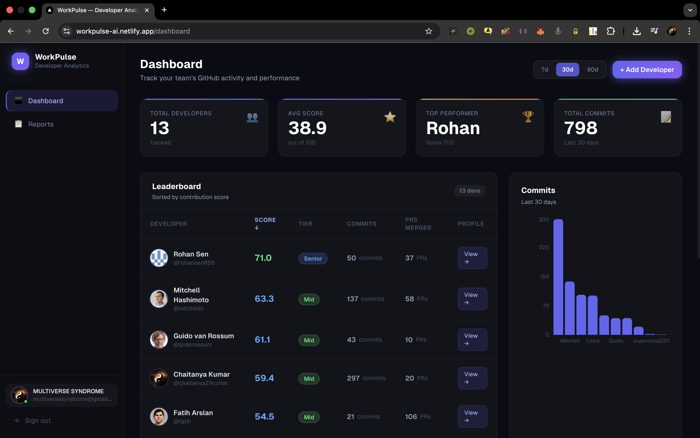
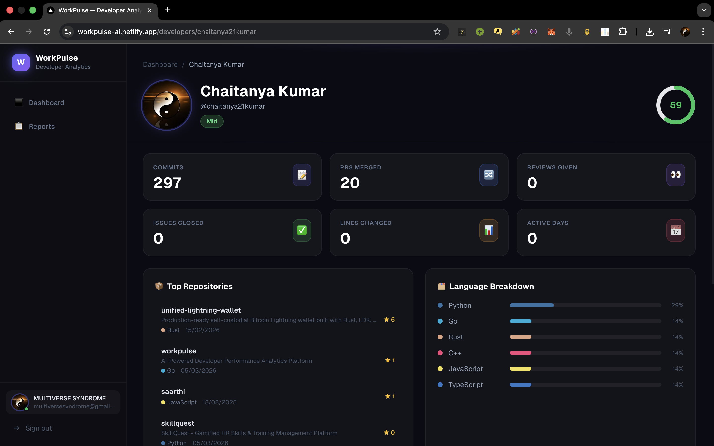
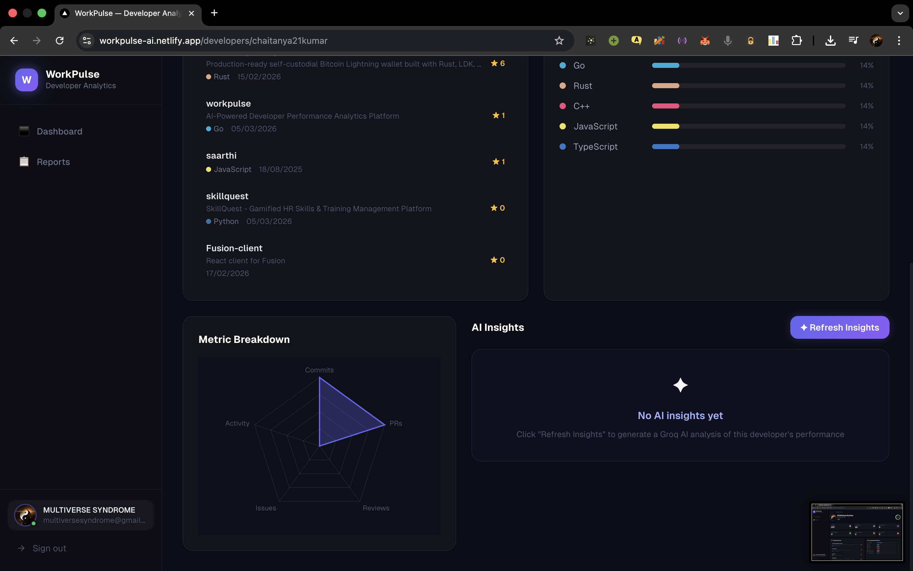
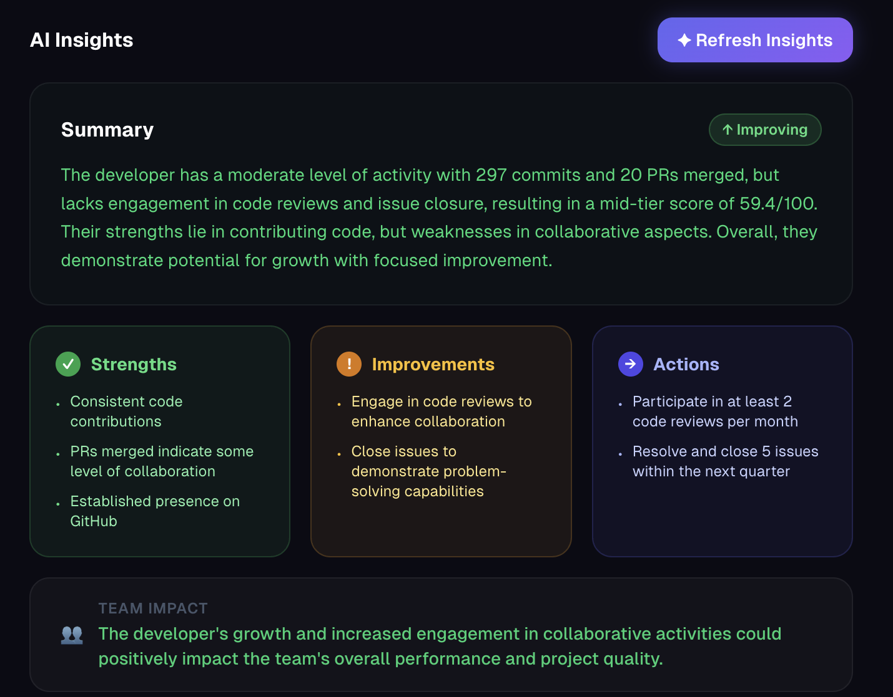
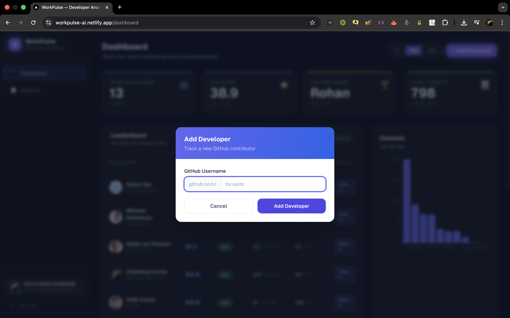

# WorkPulse — AI-Powered Developer Analytics Platform

> A full-stack engineering analytics platform that tracks GitHub contributions,
> computes ML-based developer performance scores, and generates Groq LLM insights
> for engineering teams.

**Live Demo:** https://workpulse-ai.netlify.app
**Backend API:** https://workpulse-backend-xmc1.onrender.com/health

---

## Screenshots


*Real-time leaderboard with ML-computed performance scores and team commit chart*


*Individual developer profile with GitHub metrics, score ring, and tier badge*


*Top repositories sorted by stars with language distribution bars*


*Groq LLM-generated AI insights: strengths, improvements, and concrete action items*


*Track any GitHub developer with a single username lookup*

---

## Architecture

```
Browser (Next.js 14 + TypeScript)
  │  Firebase Auth — Google OAuth
  │
  ▼
Go + Gin Backend                          ←→  Google Cloud Firestore
  ├── REST API (/api/v1/*)                      (developer profiles, metrics, reports)
  ├── GitHub Scraper (REST API v3)
  │     commits, PRs, reviews, issues
  ├── Groq LLM Service                    ←→  Groq API (llama-3.3-70b-versatile)
  │     AI insights, trend prediction           natural language analysis
  └── Report Service
        aggregate team analytics
  │
  ▼
Python FastAPI ML Service
  └── Scoring Engine (scikit-learn)
        sklearn StandardScaler + weighted
        multi-factor scoring, percentile rank
  │
  ▼
Google Cloud Firestore
```

---

## Tech Stack

| Layer | Technology | Purpose |
|-------|------------|---------|
| Backend | Go 1.25, Gin | REST API, GitHub scraping, Groq AI integration |
| ML Service | Python 3.11, FastAPI, scikit-learn | Developer scoring algorithm, percentile ranking |
| Frontend | Next.js 14, TypeScript, Tailwind CSS, Recharts | Dashboard, leaderboard, developer profiles |
| Auth | Firebase (Google OAuth) | JWT-based authentication on all API routes |
| Database | Google Cloud Firestore | Developer profiles, GitHub metrics, reports |
| AI | Groq API (llama-3.3-70b-versatile) | Natural language performance insights |
| Infra | Render.com (backend), Netlify (frontend) | Zero-cost containerised deployment |
| CI/CD | GitHub Actions | Automated build, lint, and test on every PR |

---

## Key Features

- **GitHub Metrics Scraping** — Fetches commits, PRs merged, code reviews, issues closed, lines added/deleted across all public repositories via GitHub REST API v3
- **ML Performance Scoring** — scikit-learn `StandardScaler` normalizes six raw metrics against a synthetic baseline population, applies feature weights, and outputs a 0–100 score with tier classification
- **Groq AI Insights** — LLM-generated analysis (strengths, improvement areas, action items, team impact, predicted trend) called directly from the Go backend — no separate ML service required
- **Real-time Dashboard** — Leaderboard sorted by contribution score, bar chart of team commit activity, period toggle (7d / 30d / 90d)
- **Developer Profiles** — Individual pages with radar chart breakdown, top repositories by stars, language distribution, and interactive insights panel
- **Report Generation** — Team-wide performance reports with aggregate statistics stored in Firestore
- **Public Demo Mode** — No login required; shows real GitHub profiles (torvalds, gaearon, sindresorhus) with live data

---

## API Reference

All endpoints under `/api/v1/*` require a Firebase JWT (`Authorization: Bearer <token>`) except in `development` mode.

| Method | Endpoint | Description |
|--------|----------|-------------|
| `GET` | `/health` | Service health check (no auth) |
| `GET` | `/api/v1/developers` | List all tracked developers |
| `POST` | `/api/v1/developers` | Add a developer by GitHub username |
| `GET` | `/api/v1/developers/:username` | Get developer profile + dashboard data |
| `DELETE` | `/api/v1/developers/:username` | Remove a developer |
| `POST` | `/api/v1/developers/:username/scrape` | Trigger async GitHub data refresh |
| `POST` | `/api/v1/developers/:username/insights` | Generate Groq AI insights |
| `GET` | `/api/v1/metrics/leaderboard` | Get leaderboard sorted by score |
| `GET` | `/api/v1/metrics/:username` | Get raw GitHub metrics for a developer |
| `GET` | `/api/v1/reports` | List all generated reports |
| `POST` | `/api/v1/reports/generate` | Generate new team performance report |
| `GET` | `/api/v1/reports/:developerID` | Get report for a specific developer |

---

## ML Scoring Algorithm

The scoring engine (`ml-service/app/services/scorer.py`) uses a **weighted multi-factor model** with `sklearn.preprocessing.StandardScaler`:

| Metric | Weight |
|--------|--------|
| PRs Merged | 30% |
| Commits | 25% |
| Code Reviews | 15% |
| Issues Closed | 15% |
| Lines Changed | 10% |
| Active Days | 5% |

**Pipeline:**
1. Raw metrics are z-score normalized using a scaler fitted on a 100-developer synthetic baseline population (seeded, reproducible)
2. Clipped to `[-3, 3]` to remove outlier sensitivity
3. Rescaled to `[0, 1]`, multiplied by weights, summed → raw score `[0, 100]`
4. Percentile rank computed against the baseline for relative positioning

**Tier thresholds:**

| Tier | Score Range |
|------|-------------|
| Elite | ≥ 85 |
| Senior | ≥ 70 |
| Mid | ≥ 50 |
| Junior | < 50 |

---

## Project Structure

```
workpulse/
├── backend/                          # Go 1.25 + Gin
│   ├── cmd/server/main.go            # Entry point, router setup, DI wiring
│   ├── internal/
│   │   ├── handlers/                 # HTTP handler layer (developer, metrics, reports, health)
│   │   ├── services/                 # Business logic (developer, scrape, report, Groq AI)
│   │   ├── repository/               # Firestore data access (interfaces + implementations)
│   │   ├── scraper/                  # GitHub REST API v3 scraper
│   │   ├── middleware/               # CORS, Firebase JWT auth, rate limiting, logger
│   │   └── models/                   # Shared domain models (Developer, Report, AIInsights)
│   ├── pkg/
│   │   ├── config/config.go          # Env var loading (godotenv)
│   │   └── firebase/firebase.go      # Firebase Admin SDK initialisation
│   └── tests/                        # Table-driven unit tests
│
├── ml-service/                       # Python 3.11 + FastAPI
│   ├── app/
│   │   ├── main.py                   # FastAPI app setup
│   │   ├── routers/scoring.py        # POST /score endpoint
│   │   ├── routers/insights.py       # POST /insights endpoint
│   │   └── services/
│   │       ├── scorer.py             # sklearn scoring engine
│   │       └── llm.py                # LangChain + Groq integration
│   └── tests/                        # pytest test suite
│
├── frontend/                         # Next.js 14 + TypeScript
│   ├── app/
│   │   ├── page.tsx                  # Marketing landing page
│   │   ├── dashboard/page.tsx        # Team leaderboard + chart
│   │   ├── developers/[id]/page.tsx  # Developer profile + radar + insights
│   │   ├── reports/page.tsx          # Report generation + list
│   │   ├── demo/page.tsx             # Public demo (no auth required)
│   │   └── login/page.tsx            # Google OAuth login
│   ├── components/                   # AppShell, MetricCard, InsightPanel, ScoreRing, …
│   ├── hooks/useAuth.ts              # Firebase auth hook
│   └── lib/api.ts                    # Axios client with JWT interceptor
│
├── docs/screenshots/                 # UI screenshots
├── render.yaml                       # Render.com service definitions
├── netlify.toml                      # Netlify build config
├── docker-compose.yml                # Local full-stack development
└── .github/workflows/ci.yml          # GitHub Actions CI
```

---

## Local Development

### Prerequisites

- Go 1.25+
- Python 3.11+
- Node.js 18+
- A Google Cloud project with **Firestore** enabled
- A Firebase project (for Auth) — can be the same GCP project
- [Groq API key](https://console.groq.com) (free tier)
- GitHub personal access token (for higher rate limits)

### 1. Clone & configure

```bash
git clone https://github.com/chaitanya21kumar/workpulse.git
cd workpulse
cp .env.example .env   # edit with your values
```

Required `.env` values:

```env
FIREBASE_PROJECT_ID=your-gcp-project-id
GOOGLE_APPLICATION_CREDENTIALS=./firebase-service-account.json
GROQ_API_KEY=gsk_...
GITHUB_TOKEN=ghp_...
ENVIRONMENT=development          # disables Firebase JWT auth for local testing
PORT=8080
ML_SERVICE_URL=http://localhost:8001
ALLOWED_ORIGINS=http://localhost:3000
```

### 2. Start the Go backend

```bash
cd backend
go run ./cmd/server/main.go
# Listening on :8080
```

### 3. Start the Python ML service

```bash
cd ml-service
python -m venv venv && source venv/bin/activate
pip install -r requirements.txt
uvicorn app.main:app --reload --port 8001
# Listening on :8001
```

### 4. Start the Next.js frontend

```bash
cd frontend
cp .env.production.example .env.local
# Set NEXT_PUBLIC_API_URL=http://localhost:8080 in .env.local
npm install
npm run dev
# Listening on :3000
```

### 5. Add a developer

```bash
curl -s -X POST http://localhost:8080/api/v1/developers \
  -H "Content-Type: application/json" \
  -d '{"username": "torvalds"}' | python3 -m json.tool
```

Or use the **+ Add Developer** button in the Dashboard at `http://localhost:3000/dashboard`.

---

## Testing

### Go backend

```bash
cd backend
go test ./... -race -v
```

Table-driven unit tests covering service logic, validation, and handler edge cases.

### Python ML service

```bash
cd ml-service
source venv/bin/activate
pytest tests/ -v --tb=short
```

Test suite covers scoring engine edge cases (zero input, outliers, tier boundaries), percentile ranking, and insights parsing.

### Frontend

```bash
cd frontend
npm run build   # TypeScript strict mode — zero errors = passing
```

---

## Deployment

| Service | Platform | Config |
|---------|----------|--------|
| Go backend | Render.com (free tier) | `render.yaml` → Docker, `golang:1.25-alpine` |
| Python ML service | Render.com (free tier) | `render.yaml` → Docker, `python:3.11-slim` |
| Next.js frontend | Netlify (free tier) | `netlify.toml` → `@netlify/plugin-nextjs` |
| Database | Google Cloud Firestore | Spark plan (free) |
| **Total monthly cost** | | **$0** |

The frontend auto-deploys on every push to `main`. Environment variables (`NEXT_PUBLIC_*`, Firebase config) are set in the Netlify dashboard.

---

## Environment Variables Reference

| Variable | Service | Description |
|----------|---------|-------------|
| `FIREBASE_PROJECT_ID` | Backend | GCP project with Firestore enabled |
| `GOOGLE_APPLICATION_CREDENTIALS` | Backend | Path to Firebase service account JSON |
| `GROQ_API_KEY` | Backend | Groq API key for LLM insights |
| `GITHUB_TOKEN` | Backend | GitHub PAT (increases API rate limit 60→5000 req/hr) |
| `ML_SERVICE_URL` | Backend | URL of Python scoring service |
| `ALLOWED_ORIGINS` | Backend | Comma-separated CORS origins |
| `ENVIRONMENT` | Backend | `development` skips Firebase JWT auth |
| `NEXT_PUBLIC_API_URL` | Frontend | Backend base URL |
| `NEXT_PUBLIC_FIREBASE_*` | Frontend | Firebase web SDK config (7 vars) |

---

## Author

**Chaitanya Kumar** — Built as a backend engineering portfolio project demonstrating Go service design, ML integration, LLM orchestration, and full-stack deployment.

- GitHub: [@chaitanya21kumar](https://github.com/chaitanya21kumar)
